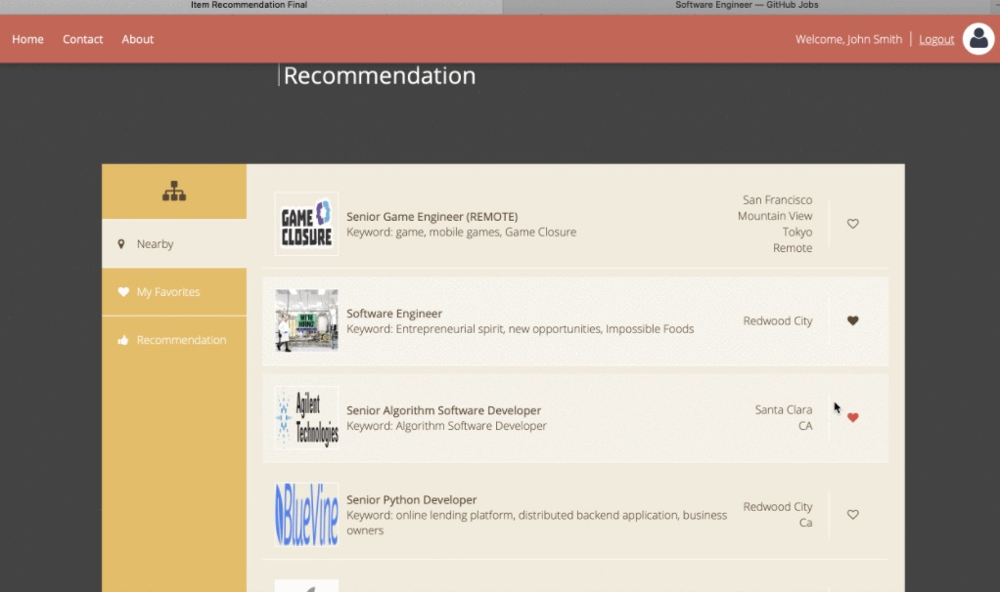
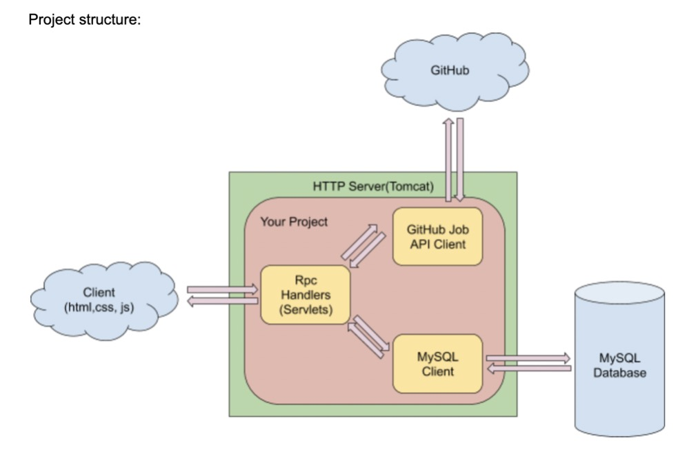

# Job+: AWS based Web Service Development

### Recommendation Model
**Item based / User based / Content based(this project)**
precision and recall

### Restful API
A RESTful API is an application program interface (API) that uses HTTP methods like GET, PUT, POST, and DELETE to manage resources. It’s also stateless. 

Examples:https://www.youtube.com/results?search_query=job 

`GET` - Request data from the server.

`POST` - Create data on the server.

`PUT` - Update data on the server.

`DELETE` - Delete data on Server. 

### Project Structure

### Front-End
HTML / CSS / JavaS cript.

[https://www.toptal.com/html5/interview-questions](https://www.toptal.com/html5/interview-questions)

[https://css-tricks.com/snippets/css/a-guide-to-flexbox/](https://css-tricks.com/snippets/css/a-guide-to-flexbox/)

[https://css-tricks.com/snippets/css/complete-guide-grid/](https://css-tricks.com/snippets/css/complete-guide-grid/)

[https://www.w3schools.com/css/default.asp](https://www.w3schools.com/css/default.asp)

### Algorithms
**TF-IDF**
TF-IDF algorithm tells you the ordered keywords in a text document (keyword extraction).

TF (Term frequency) is the frequency of a word in a document. However, ‘a’, ‘the’, ‘is’ are common in every document and their TF values are high in almost every document which will overwhelm some real keywords. 

IDF (Inverse Document Frequency) is the importance of a word in general. IDF values are very low for these meaningless words. Final score is Final score = TF * IDF.

### MonkeyLearn API
Support the API of MachineLearning.

[https://app.monkeylearn.com/accounts/login/?next=/main/explore/](https://app.monkeylearn.com/accounts/login/?next=/main/explore/)

### MySQL
JDBC: JDBC (Java Database Connectivity) provides interfaces and classes for writing database operations. Technically speaking, JDBC is a standard API that defines how Java programs access database management systems.

**SQL Syntax**

Syntax for `DROP`. 

`DROP` TABLE IF EXISTS table_name;

Syntax for `CREATE`. 

`CREATE` TABLE table_name (column1 datatype, column2 datatype, ....);

Syntax for `INSERT`.

`INSERT` INTO table_name (column1, column2, column3, ...) VALUES (value1, value2, value3, ...);

Syntax for `SELECT`.

`SELECT` column1, column2, … FROM table_name;

### Amazon EC2
EC2 / RDS

### Authentication (Login/Logout)
Cookie / Session / JWT.

### optimization
**jQuery**

[https://jquery.cuishifeng.cn/](https://jquery.cuishifeng.cn/)

**Ajax**

[https://api.jquery.com/jquery.ajax/](https://api.jquery.com/jquery.ajax/)
